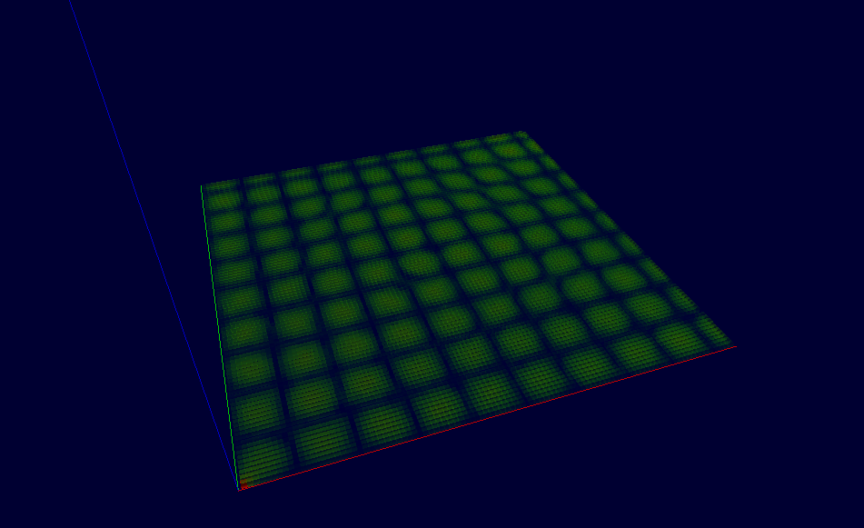
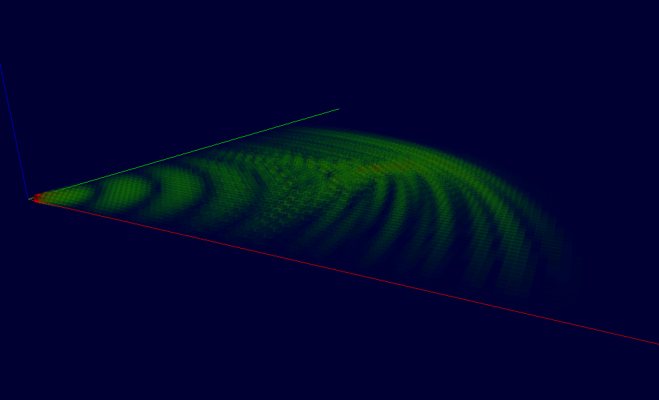
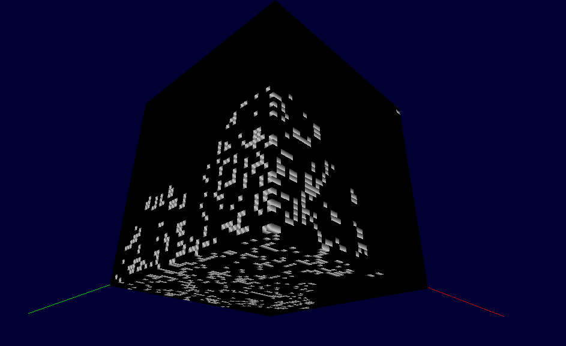
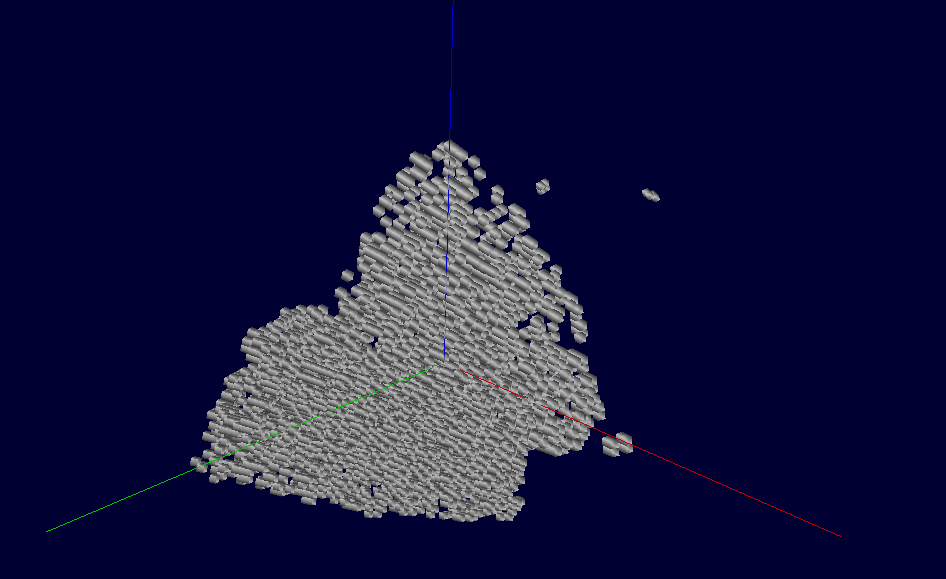
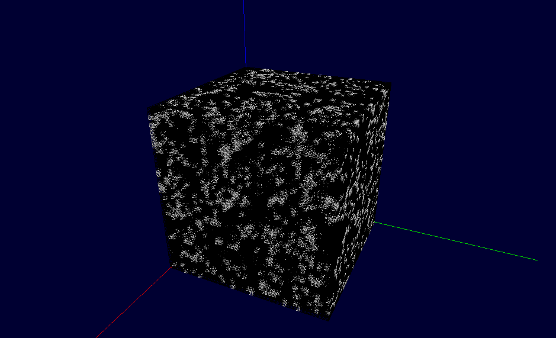
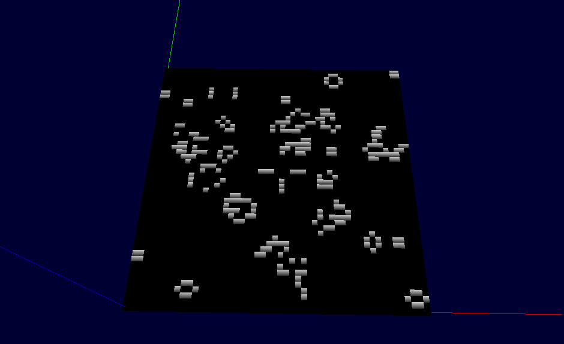

# Game of 3D Life (voxel visualizer)

**Work in progress**

A "voxel visualizer" implementing following simulations:

* Game of Life: identical rules to the 2D version, only extended to 3D
* FDTD (finite differences time domain) Maxwell equations simulation, 2D and 3D variant
    * code taken from the book "ELECTROMAGNETIC SIMULATION USING THE FDTD METHOD" by DENNIS M. SULLIVAN

Work in progress, this is only a rough sketch of the application. Needs a lot of work. Build instructions will be provided once it's done.

## Images

### FDTD resonance

### FDTD wave propagation

### Game of Life

## Controls

### Mouse

* LMB - rotate
* MMB - pan
* Scroll - zoom

### Keyboard

* 'A' - turn on/off transparency (alpha)
* 'Z' - wireframe rendering on/off
* 'Space' - pause/play the simulation
* 'R' - reset the simulation
* 'U' - single step of the simulation
* 'P' - turn wave source on/off (only applicable to FDTD)

## TODO

- [x] Simulation playback
    - [x] record simulation
    - [x] playback
- [x] simple FDTD
    - [x] 2D variant?
- [ ] Load Kicad 3D model
- [ ] Fix TODOs
- [ ] Use CVec with SimulationCoords for simulation coordinates
- [ ] remove position from voxel
- [ ] Better (and more efficient) voxel drawing
    - [ ] fix normals for the voxels
    - [ ] custom shaders? only pass color + alpha to the GPU
- [ ] Decrease compilation time (pimpl)
- [ ] Formatter
- [ ] Profiling - when simulation is done
- [ ] CPython interface?
- [ ] [draw architecture](https://plantuml.com/component-diagram)
    - [ ] refactor ?

## Performance

For 3D GoL 50^3 cells. All times in ms. Simulating until the whole space is filled with cubes. In fullscreen

| Commit  | Render 50^3 | Simulation 50^3 | Render 100^3 | Simulation 100^3 |
| ---     | ---         | ---             | ---          | ---              |
| b54ec9c | 40.161      | 3.97671         | 312.757      | 381.396          | 
